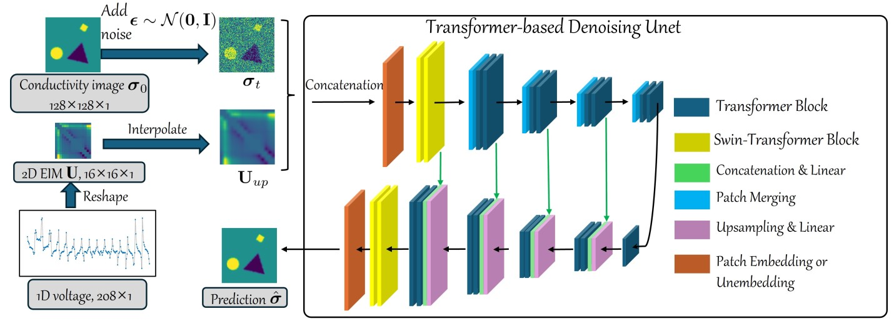

## A Conditional Diffusion Model for Electrical Impedance Tomography Image Reconstruction  
The code in this toolbox implements the "[A Conditional Diffusion Model for Electrical Impedance Tomography Image Reconstruction](https://arxiv.org/abs/2412.16979)". More specifically, it is detailed as follow.




## Training

- **Simulated data:** The EIDORS generated dataset is at https://drive.google.com/file/d/1pNSEdf3nxn809pkFCoHGuSydcU9yT7Pw/view?usp=drive_link

- **Real-world data:** Two real-world data can be downloaded from https://fips.fi/open-datasets/eit-datasets/2d-electrical-impedance-tomography-dataset/ for the 2D electrical impedance tomography dataset collected by the Finnish Inverse Problems Society at the University of Eastern Finland in 2017 (UEF2017) and https://zenodo.org/records/8252370 for the Kuopio Tomography Challenge 2023 (KTC2023).

  The real data has been placed in the `./data/` in the appropriate format.

- Put the data at `./data/` and run `python main.py --mode train`


## Test

- The pretraining weight `best.pt` is at https://drive.google.com/file/d/1xOP4PMbGpsgz1e1s3BtHx4cFPfGUnlnn/view?usp=drive_link
- Download the pretraining weight and put it to `./results/deit/checkpoints`
- Put the test data at `./data/`  and run `python main.py --mode test --data simulated` for EIDORS generated data, `python main.py --mode test --data uef2017` for UEF2017 dataset or `python main.py --mode test --data ktc2023`  for KTC2023 dataset
- The prediction will be at  `./results/deit/checkpoints`

## Citation

**Please kindly cite the papers if this code is useful and helpful for your research.**
```
@article{shi2024neural,
   title={A Conditional Diffusion Model for Electrical Impedance Tomography Image Reconstruction},
   author={Shi, Shuaikai and Kang, Ruiyuan and  Liatsis, Panos},
   journal={arXiv preprint arXiv:2412.16979},
   year={20244}
}
```

## Contact Information:

If you encounter any bugs while using this code, please do not hesitate to contact us.


Shuaikai Shi [shuaikai.shi@ku.ac.ae] 


